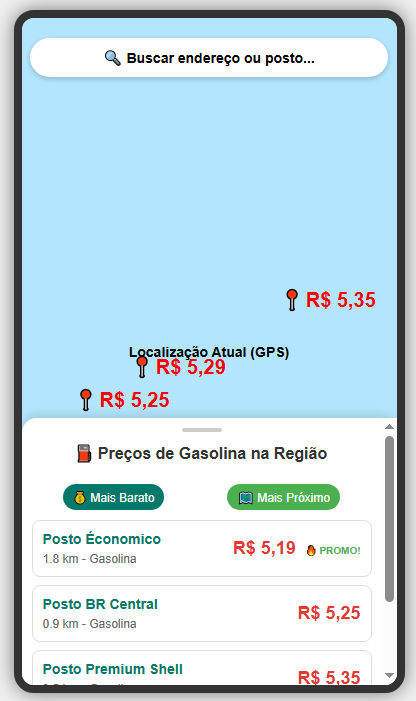
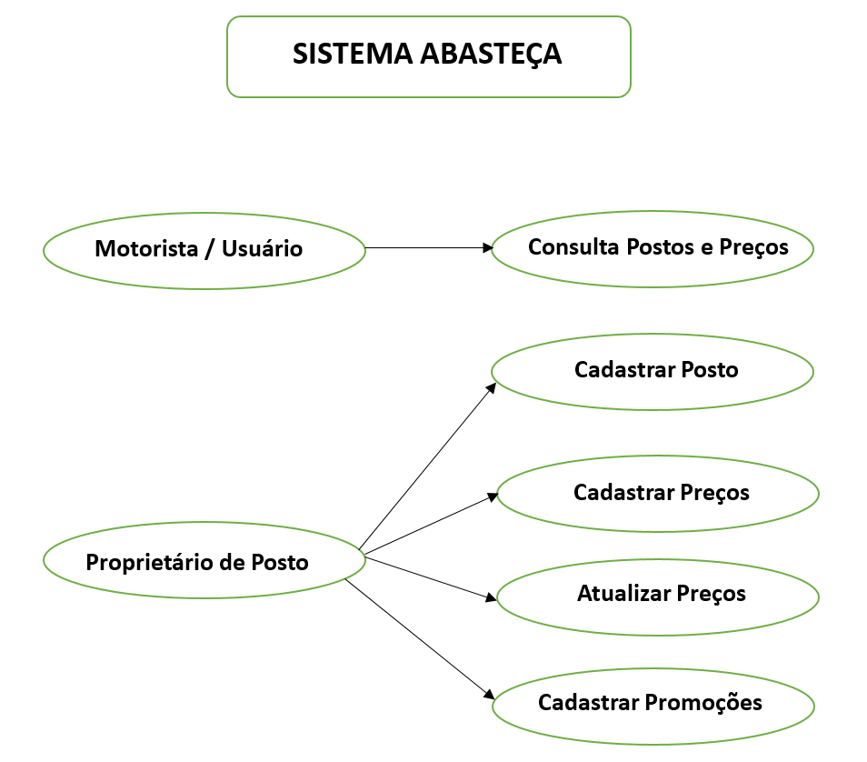
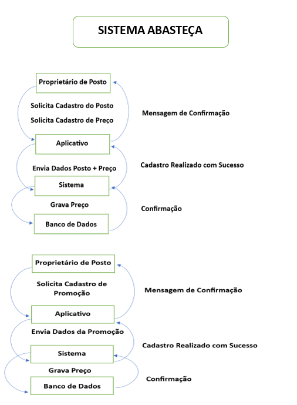

# Abastecaqui

O que é o Abasteçaqui:
O Abasteçaqui foi desenvolvido com o objetivo de trazer mais informações referente a postos de combustíveis no que diz respeito a loclização e preços.
O Abasteçaqui é uma aplicação Mobile, que visa facilitar a vida dos motoristas, trazendo informações referente a preços de combustíveis.
O que nos Motivou a desenvolver o StravaClone:
A Dificuldade que eu tenho em saber qual posto está mais em conta, tanto com preços quanto localização, me motivou a criar essa plataforma.

## 🚧 Status do Projeto *Status:* Em Processo de Desenvolvimento

## ⚙ Funcionalidades e Demonstração da Aplicação
Funcionalidades Principais
[Funcionalidade 1]: Cadastro e autenticação de novos usuários.(Donos de Postos e Motoristas)
[Funcionalidade 2]: Cadastro de preços e promoções
[Funcionalidade 3]: Interface responsiva para acesso via dispositivos móveis.

VISUALIZAÇÃO DA PÁGINA HOME:
Interface Mobile:

  

 <h2>📚 Casos de Uso</h2>

<h3>Atores:</h3>
<ul>
    <li><strong>Proprietário do Posto</strong> (responsável pelo cadastro/atualização dos preços)</li>
    <li><strong>Usuário/Motorista</strong> (consulta os preços e localiza postos)</li>
    <li><strong>Sistema</strong></li>
</ul>

<h3>Principais casos de uso:</h3>

<ol>
    <li>
        <strong>Proprietário cadastra posto de combustível</strong>
        <ul>
            <li>Proprietário informa nome, localização, bandeira do posto.</li>
            <li>Sistema registra o posto.</li>
        </ul>
    </li>
    <li>
        <strong>Proprietário cadastra preços de combustíveis</strong>
        <ul>
            <li>Proprietário seleciona um posto.</li>
            <li>Insere valores de gasolina, etanol, diesel etc.</li>
            <li>Sistema salva.</li>
        </ul>
    </li>
    <li>
        <strong>Proprietário atualiza preços</strong>
        <ul>
            <li>Proprietário edita valores antigos.</li>
            <li>Sistema mantém histórico de alterações.</li>
        </ul>
    </li>
    <li>
        <strong>Proprietário pode criar promoções no aplicativo</strong>
        <ul>
            <li>Proprietário cria promoções no aplicativo.</li>
            <li>Sistema destaca a promoção.</li>
            <li>Essa funcionalidade tem prazo de validade.</li>
            <li>Promo Extra é cobrada de acordo com o plano escolhido.</li>
        </ul>
    </li>
    <li>
        <strong>Usuário consulta postos e preços</strong>
        <ul>
            <li>Usuário pesquisa por localização ou filtragem (mais barato, mais próximo).</li>
            <li>Sistema retorna lista com preços.</li>
        </ul>
    </li>
</ol>

## ⛽️ Diagrama de Sequência (exemplo: Proprietário de posto cadastra preço)

1. Proprietário → App: solicita cadastro de preço.
2. App → Sistema: envia posto + valores.
3. Sistema → Banco de Dados: grava preços.
4. Banco de Dados → Sistema: confirma.
5. Sistema → App: retorna sucesso.
6. App → Cliente: exibe "Preço cadastrado com sucesso".

---

## ⛽️ Histórias de Usuário

1. **Cadastro de posto**
    - Como proprietário de posto
    - Quero cadastrar meu posto com nome e endereço
    - Para que ele fique visível para os motoristas.

2. **Cadastro de preços**
    - Como proprietário de posto
    - Quero inserir os preços atualizados dos combustíveis
    - Para que os motoristas tenham acesso a informações corretas.

3. **Consulta de postos**
    - Como motorista
    - Quero visualizar os postos mais próximos e seus preços
    - Para escolher o que mais me convém.

4. **Atualização de preços**
    - Como proprietário de posto
    - Quero editar preços desatualizados
    - Para que o app reflita os valores reais.

5. **Cadastro de Promoções**
    - Como proprietário de posto
    - Quero inserir promoções no App
    - Para atrair mais motoristas para abastecer no meu posto.
  
## ⛽️ Cenários em Gherkin

### Funcionalidade: Cadastro de postos
- Como proprietário de um posto  
- Quero cadastrar meu posto no aplicativo  
- Para que motoristas possam consultá-lo.

**Cenário: Cadastrar posto com sucesso**
- Dado que o proprietário está na tela de cadastro de posto  
- Quando ele informa nome "Posto BR" e endereço "Av. Central, 500"  
- E confirma o cadastro  
- Então o sistema deve salvar o posto e exibir "Posto cadastrado com sucesso"

---

### Funcionalidade: Cadastro de preços
- Como proprietário de um posto  
- Quero cadastrar os preços de combustíveis  
- Para que os motoristas tenham acesso às informações atualizadas.

**Cenário: Cadastrar preço da gasolina**
- Dado que existe um posto cadastrado "Posto BR"  
- Quando o proprietário informa o preço "R$ 5,29" para gasolina  
- E confirma o registro  
- Então o sistema deve salvar o preço informado

---

### Funcionalidade: Consulta de preços
- Como motorista  
- Quero visualizar os postos e seus preços  
- Para escolher onde abastecer.

**Cenário: Consultar postos próximos**
- Dado que existem postos cadastrados  
- Quando o motorista pesquisa por localização via GPS do celular  
- Então o sistema deve exibir uma lista de postos da região com preços atualizados

## ⛽️ Diagrama de Casos

## ⛽️ Diagrama de Sequência

## ⛽️ 5W2H das Funcionalidades

---

### 📌 Funcionalidade: Cadastro de Postos

**What (O quê?)**  
Cadastro de um novo posto de combustível no sistema.

**Why (Por quê?)**  
Para que motoristas consigam visualizar o posto no aplicativo.

**Who (Quem?)**  
Proprietário do posto.

**Where (Onde?)**  
Na tela de cadastro dentro do aplicativo.

**When (Quando?)**  
Sempre que um proprietário desejar cadastrar um novo posto.

**How (Como?)**  
Informando nome, endereço e demais dados obrigatórios.

**How Much (Quanto?)**  
Sem custo adicional.

---

### 📌 Funcionalidade: Cadastro de Preços

**What (O quê?)**  
Registro e atualização dos preços dos combustíveis.

**Why (Por quê?)**  
Para fornecer informações atualizadas aos motoristas.

**Who (Quem?)**  
Proprietário do posto.

**Where (Onde?)**  
Na aba de preços do app.

**When (Quando?)**  
Quando houver alteração nos valores.

**How (Como?)**  
Inserindo os valores dos combustíveis e confirmando.

**How Much (Quanto?)**  
Sem custo extra.

---

### 📌 Funcionalidade: Consulta de Preços

**What (O quê?)**  
Visualização de postos próximos e seus preços.

**Why (Por quê?)**  
Para ajudar motoristas a escolher o melhor local para abastecer.

**Who (Quem?)**  
Motorista/usuário do aplicativo.

**Where (Onde?)**  
Na área de busca e mapas do app.

**When (Quando?)**  
A qualquer momento.

**How (Como?)**  
Usando o GPS do celular ou filtros de busca.

**How Much (Quanto?)**  
Gratuito.

---

### 📌 Funcionalidade: Atualização de Preços

**What (O quê?)**  
Alteração dos valores de combustíveis cadastrados.

**Why (Por quê?)**  
Garantir que os preços exibidos sejam os reais.

**Who (Quem?)**  
Proprietário do posto.

**Where (Onde?)**  
Na tela de edição de preços do app.

**When (Quando?)**  
Sempre que os valores mudarem.

**How (Como?)**  
Editando o valor anterior e salvando.

**How Much (Quanto?)**  
Sem custo.

---

### 📌 Funcionalidade: Cadastro de Promoções

**What (O quê?)**  
Inserção de promoções temporárias no aplicativo.

**Why (Por quê?)**  
Atrair mais motoristas e aumentar o volume de abastecimentos.

**Who (Quem?)**  
Proprietário do posto.

**Where (Onde?)**  
No painel de promoções do aplicativo.

**When (Quando?)**  
Durante períodos promocionais definidos pelo proprietário.

**How (Como?)**  
Informando descrição, preço, combustível e validade.

**How Much (Quanto?)**  
Pode variar conforme o plano contratado.

